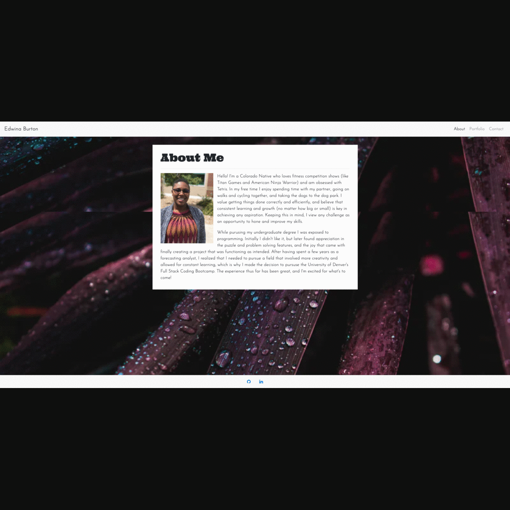

# Responsive-Portfolio-CCC-Bootstrap

## Objective

Create an updated mobile responsive portfolio that features two exemplary projects, includes links to GitHub and LinkedIn profiles, as well as a downloadable PDF of resume. 

## Tools Implemented

* Boostrap Grid Layout, CSS, and JavaScript

* Google Fonts

* Social Media Icon Libray

## Challenges

* Font Adjustments for:

    * Navbar - changing font weight and setting custom color (outside of built-in Boostrap CSS text colors)

    * Bootstrap Table Header - Tribute Page for Portfolio

* Sticky Footer & centering social media icons 

* Creating clickable image link for example portfolio projects

    * Making anchor tag images responsive on Portfolio Page

    * Centering anchor image text description 

## Website Mock-Up

The following animation demonstrates the portfolio's apperance and functionality:

## Link to Webiste

* [Responsive Portfolio](https://e-burton.github.io/Updated-Responsive-Portfolio/)

## Additional Resources

* [Sticky Footer](https://github.com/understrap/understrap/issues/525)
* [Making Things Full Page](https://github.com/alvarotrigo/fullPage.js/issues/854#:~:text=100vw%20means%20100%25%20of%20the,when%20doing%20full%20screen%20slides%E2%80%A6)
* [A Complete Guide to Flexbox](https://css-tricks.com/snippets/css/a-guide-to-flexbox/)
* [How To: Social Media Buttons](https://www.w3schools.com/howto/howto_css_social_media_buttons.asp)
* [Centering iframe in Bootstrap](https://stackoverflow.com/questions/25560954/how-do-i-center-youtube-video-iframe-in-twitter-bootstrap-3)
* [How to Capture Full Page Screenshots](https://helpdeskgeek.com/how-to/how-to-capture-full-page-screenshots-in-chrome-firefox/)

